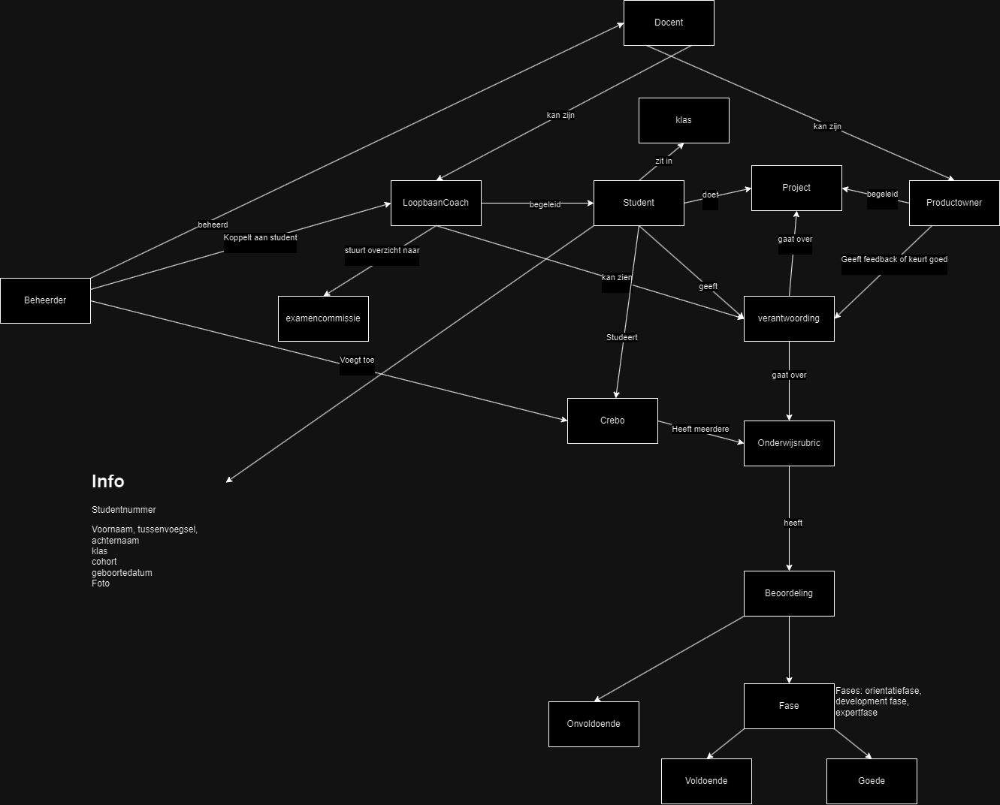

# AVISICODECHALLENGE

### **Overeenkomende User Stories**

De overeenkomende user stories gaan vaak over basistaken zoals inloggen, uitloggen, en het verkrijgen van overzichten, die door meerdere actoren gedeeld worden. De unieke user stories betreffen specifieke acties die zijn toegespitst op de verantwoordelijkheden van de individuele rollen zoals de student, PO, LBC of beheerder.

1. **Inloggen:**
   - **Student, PO (Docent), LBC (Docent), Beheerder**
   - Het inloggen is een algemene actie die door elke rol wordt uitgevoerd. De eisen (2FA, wachtwoordbeleid, etc.) zijn hetzelfde voor alle actoren.

2. **Uitloggen:**
   - **Student, PO (Docent), LBC (Docent), Beheerder**
   - Alle rollen moeten kunnen uitloggen wanneer ze klaar zijn met hun taken.

3. **Overzicht:**
   - **Student, PO (Docent), LBC (Docent)**
   - Alle rollen willen een overzicht krijgen van relevante informatie: studenten voor docenten, criteria en voortgang voor studenten.

4. **Notities maken/wijzigen:**
   - **PO (Docent), LBC (Docent)**
   - Beide rollen willen notities kunnen maken over studenten en die indien nodig kunnen wijzigen (aanvullingen of correcties).

5. **Feedback/Beoordeling:**
   - **PO (Docent), LBC (Docent)**
   - Beide docentenrollen willen feedback kunnen geven en beoordelingen vastleggen of wijzigen om studenten te begeleiden.

6. **Filteren en sorteren:**
   - **PO (Docent), LBC (Docent)**
   - Beide rollen willen gegevens filteren en sorteren voor een beter overzicht van hun taken.

7. **Rol wissel:**
   - **PO (Docent), LBC (Docent)**
   - Beide rollen willen kunnen schakelen tussen hun verschillende functies zonder opnieuw in te loggen.

---

### **Unieke User Stories**

1. **Student:**
   - **Selecteren criteria (student):** De student wil zelf aangeven aan welke criteria hij werkt, iets wat specifiek is voor de student.
   - **Verantwoording schrijven/wijzigen:** Het verantwoorden en aanpassen van uitleg waarom bepaalde criteria zijn gehaald, is specifiek voor de student.
   - **Overzicht totaal/periode:** De student wil zijn voortgang zien op basis van behaalde en te behalen criteria, uniek voor de student.

2. **PO (Docent):**
   - **PO's koppelen:** De PO wil studenten koppelen aan andere PO's, wat een unieke verantwoordelijkheid is van de PO.
   - **Verantwoording student lezen/goedgekeuren:** Het beoordelen van de verantwoording van studenten is specifiek voor de PO.
   - **Andere studenten beoordelen:** De PO wil ook studenten van collega's kunnen beoordelen bij afwezigheid, iets wat specifiek is voor deze rol.

3. **LBC (Docent):**
   - **Seintje als klaar:** De LBC wil een notificatie ontvangen wanneer een student klaar is om te diplomeren.
   - **Beslissingsdocument/Beslissingsdocument opslaan als PDF:** De LBC wil een beslissingsdocument opstellen en opslaan voor de examencommissie, wat uniek is voor deze rol.

4. **Beheerder:**
   - **Nieuwe crebo invoeren:** De beheerder wil nieuwe kwalificatiedossiers kunnen invoeren.
   - **Nieuwe onderwijsrubric invullen:** Het opzetten van rubrics voor nieuwe crebo's is een taak specifiek voor de beheerder.
   - **Beheerders/docenten toevoegen/inactief zetten:** Het beheren van rollen zoals beheerders en docenten is uniek voor de beheerder.
   - **Inlezen studentgegevens:** Het importeren van studentgegevens is een unieke beheertaak.
   - **Foto bij student toevoegen:** Een unieke actie van de beheerder om visuele informatie toe te voegen.
   - **Studenten koppelen aan LBC:** Het koppelen van studenten aan LBC’s is een specifieke taak van de beheerder.
   - **Studentgegevens wijzigen:** Het aanpassen van studentgegevens om ze up-to-date te houden, behoort tot de unieke beheertaken. 

